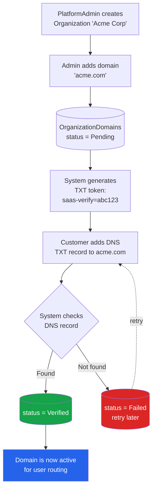
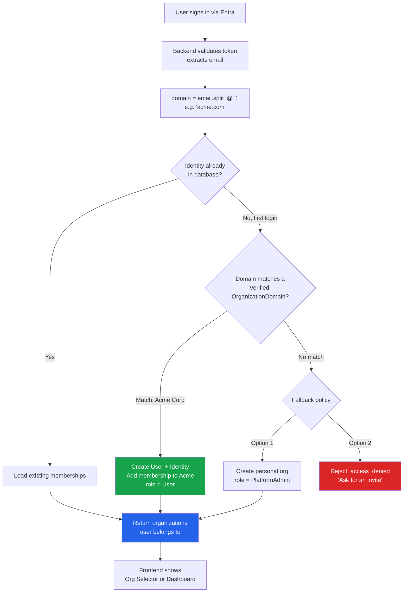
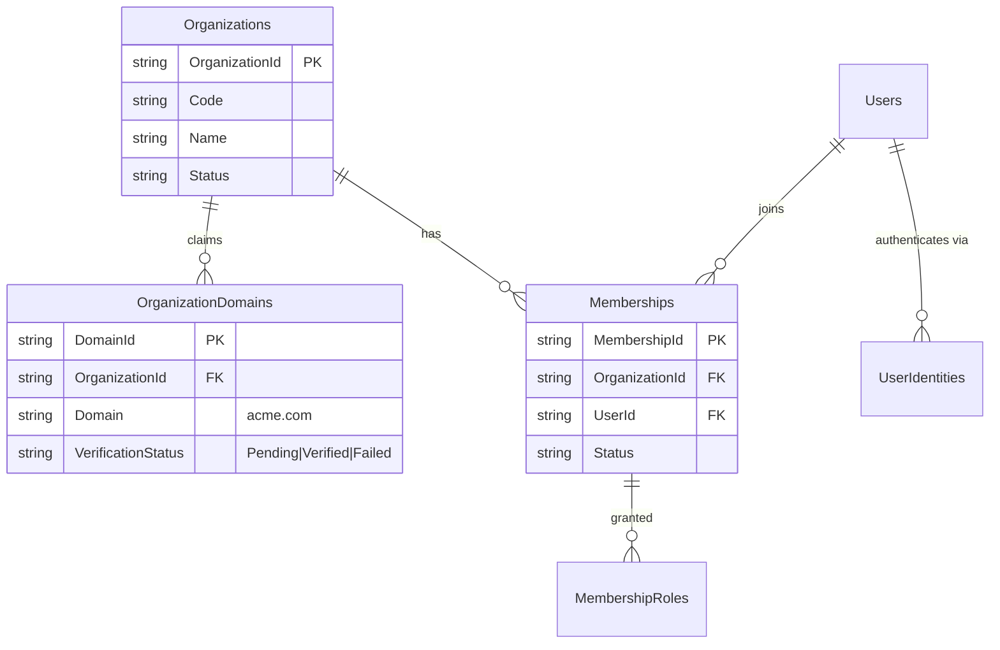

# Multi-Customer Domain-Based Tenancy

How to give each customer their own email domain, and automatically route users under that domain into the right organization.

> **📊 Visual flow diagrams:** https://claude.ai/artifact/6aWmL9cGbgDaELzQNGUQsR

> **Status:** Design guide. The `OrganizationDomains` table exists in the schema; the routing logic and UI described here are the recommended implementation.

---

## The core idea

Each **customer Organization** claims one or more **email domains** (e.g. Acme claims `acme.com`). When a user signs in, the app reads their email domain and routes them to the matching organization — no manual invitation needed.

```
alice@acme.com    →  Acme Corp      (domain: acme.com)
bob@globex.com    →  Globex Inc     (domain: globex.com)
carol@gmail.com   →  no match       →  personal org OR access denied
```

---

## Concepts recap

| Term | Meaning | Count |
|---|---|---|
| **Entra Tenant** | Microsoft identity directory (`fpass`) — where logins/passwords live | One |
| **Organization** | A customer company in your app's DB (SaaS tenant) | Many |
| **Organization Domain** | An email domain a customer owns, e.g. `acme.com` | Many per org |
| **Membership** | Links a user to an organization with roles | Many per user |

---

## Diagram 1 — Domain claim & verification

Before users can be routed by domain, the customer must **prove they own the domain** (so nobody can claim `gmail.com` and absorb every Gmail user).



---

## Diagram 2 — User first-login routing

This is the key flow. It replaces today's "give everyone a personal org" logic with domain-based routing.



---

## Diagram 3 — Multi-customer isolation

One Entra tenant, many customer organizations, each fed by its own domain.

```mermaid
flowchart TB
    subgraph ENTRA["Entra Tenant 'fpass' — ONE identity directory"]
        U1[alice@acme.com]
        U2[dave@acme.com]
        U3[bob@globex.com]
        U4[carol@gmail.com]
    end

    subgraph APP["Your SaaS App — MANY organizations"]
        subgraph ORG1["Org: Acme Corp"]
            D1[domain: acme.com]
            M1[Members: alice, dave]
        end
        subgraph ORG2["Org: Globex Inc"]
            D2[domain: globex.com]
            M2[Members: bob]
        end
        subgraph ORG3["Personal / fallback"]
            M3[carol - own org]
        end
    end

    U1 -->|acme.com| ORG1
    U2 -->|acme.com| ORG1
    U3 -->|globex.com| ORG2
    U4 -->|no match| ORG3

    style ORG1 fill:#eff6ff
    style ORG2 fill:#f0fdf4
    style ORG3 fill:#fffbeb
```

---

## Data model



---

## Implementation checklist

### Backend

- [ ] **`organizationDomainRepository.js`** — CRUD for domains
  - `create({ domainId, organizationId, domain, verificationStatus })`
  - `findByDomain(domain)` — returns org if `Verified`
  - `listByOrganization(orgId)`
  - `updateStatus(domainId, status)`
  - `remove(domainId)`

- [ ] **Domain endpoints** (in a new `routes/domains.js` or under organizations)
  - `POST /api/organizations/:orgId/domains` — claim a domain (status `Pending`)
  - `GET /api/organizations/:orgId/domains` — list
  - `POST /api/organizations/:orgId/domains/:id/verify` — check DNS TXT record
  - `DELETE /api/organizations/:orgId/domains/:id` — remove

- [ ] **Change auto-provisioning** in `tenantSelector.js`:
  ```js
  function resolveOrgForNewUser(identity) {
    const domain = (identity.email || "").split("@")[1]?.toLowerCase();
    if (domain) {
      const org = orgDomainRepo.findByDomain(domain); // Verified only
      if (org) return { organizationId: org.OrganizationId, role: "User" };
    }
    // Fallback policy — pick ONE:
    // A) personal org (current behavior)
    // B) return null → route responds 403 access_denied
    return null;
  }
  ```

### Frontend

- [ ] **Organizations page** — "Domains" section per org: add domain, show status badge, "Verify" button showing the TXT record to add.
- [ ] **Access-denied screen** — if fallback is "reject", show a friendly "No workspace for your email domain — ask your admin for an invite."

### DNS verification (production)

- [ ] Generate a per-domain token: `saas-verify=<random>`
- [ ] Customer adds a TXT record at `acme.com` (or `_saas-verify.acme.com`)
- [ ] Verify endpoint does a DNS lookup (`node:dns/promises` → `resolveTxt`)
- [ ] On match, set status `Verified`

```js
import { resolveTxt } from "node:dns/promises";

async function verifyDomain(domain, expectedToken) {
  try {
    const records = await resolveTxt(`_saas-verify.${domain}`);
    return records.flat().some((r) => r === expectedToken);
  } catch {
    return false;
  }
}
```

---

## Important caveats

1. **Never route by an unverified domain.** Only `Verified` domains feed the routing logic, or a customer could claim a public domain like `gmail.com`.

2. **Public email providers.** Block or ignore `gmail.com`, `outlook.com`, `yahoo.com`, etc. — these can never belong to one customer. Keep a denylist.

3. **The Entra side is separate.** The email domain your users *have* is controlled by your Entra tenant. For customers to log in with real `@acme.com` addresses, you either invite them as guests/federated identities, or add `acme.com` as a verified custom domain in Entra (Entra ID → Custom domain names). The app-level domain→org mapping in this doc is independent of that.

4. **One user, multiple domains.** A user could match more than one org over time (e.g. invited to a second org). Domain routing only affects the *first* auto-join; after that, memberships are explicit.

---

## Summary flow (one line)

```
Login → extract email domain → match Verified OrganizationDomain
      → auto-join that customer's org (role: User)
      → else fallback (personal org OR access denied)
```
